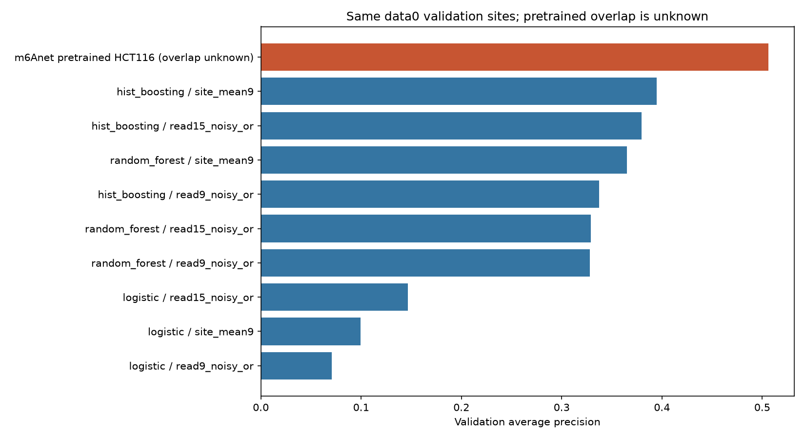

# Official pretrained m6Anet comparison

The official m6Anet HCT116 RNA002 checkpoint was run on the unchanged data0 validation set. This is a pretrained reference; its overlap with the course data is unknown. It is not an independent generalization estimate or a matched-training comparison.

| Model | Approach | AP | ROC AUC | Trapezoidal PR AUC | Brier score |
|---|---|---:|---:|---:|---:|
| m6anet_pretrained_HCT116_RNA002 | official_m6anet | 0.5064 | 0.9346 | 0.5059 | 0.0925 |
| hist_boosting | site_mean9 | 0.3948 | 0.8641 | 0.3943 | 0.0321 |
| hist_boosting | read15_noisy_or | 0.3799 | 0.8782 | 0.3793 | 0.2375 |
| random_forest | site_mean9 | 0.3649 | 0.8589 | 0.3640 | 0.0333 |
| hist_boosting | read9_noisy_or | 0.3375 | 0.8604 | 0.3366 | 0.2713 |
| random_forest | read15_noisy_or | 0.3288 | 0.8654 | 0.3282 | 0.2530 |
| random_forest | read9_noisy_or | 0.3282 | 0.8538 | 0.3273 | 0.2846 |
| logistic | read15_noisy_or | 0.1466 | 0.7760 | 0.1461 | 0.2944 |
| logistic | site_mean9 | 0.0994 | 0.7071 | 0.0987 | 0.0406 |
| logistic | read9_noisy_or | 0.0709 | 0.6934 | 0.0707 | 0.3323 |



**Measured comparison**

- m6Anet returned predictions for all 25,350 validation sites, with 1,103 positive labels. Key sets, read counts, central motifs, and finite probability bounds were verified.
- The AP difference relative to the strongest classical run (hist_boosting, site_mean9) is +0.1116. This is a descriptive difference, not a significance or generalization claim.
- Official inference took 52.7 seconds in the Linux amd64 container on this Apple Silicon host. Classical models ran natively, so runtimes are not a hardware-matched speed comparison.

**Environment and input integrity**

- Official Bioconda m6Anet 2.1.0, Python 3.8.20, PyTorch 1.6.0. The upstream inference implementation and checkpoint were not edited.
- Synthetic site-local read indices were appended after the original nine signal features. All signal values were checked for exact preservation, and all byte offsets were independently checked. Only validation sites were supplied to the model.
- Frozen split SHA-256: `cbf2d0405abc707a557802dd3bc87cd218aae5a9b597ee71d1a58665dd8c07ad`.
- Checkpoint SHA-256: `61017b5e856063a5ef165eb024975bedca57c17ab9242a094a04dd65b38873dd`.
- Normalization SHA-256: `e9d2060167c226f954c71a98727062839519f10d948e109e01931d58cd15e48c`.
- Per-run artifacts include raw official site/read outputs, joined validation scores, metrics, curves, logs, model/config hashes, source snapshots, container identity, and the exact conda package export.

**Interpretation limits**

- Pretraining used HCT116, and we do not know which course data0 genes/sites it included. Our validation split was withheld from the classical models, but cannot be assumed to have been withheld from the pretrained checkpoint.
- HCT116_RNA002 is the official default human model. The supplied course context does not establish sequencing chemistry independently, so checkpoint chemistry compatibility remains an assumption to confirm.
- m6Anet uses its own normalization and learned neural embedding, 20 reads sampled with replacement, and 1,000 iterations. Classical read baselines use fixed PCA embeddings and five 20-read repetitions without replacement. These differences are intentionally retained and documented.
- Compare `probability_modified` from the site output. `mod_ratio` is not used as a site probability. Official inference does not return per-iteration variance, so that diagnostic is recorded as unavailable.
- A fair training-controlled comparison would retrain m6Anet on exactly the training genes and estimate normalization from those genes. That is a separate experiment.

**Reproduce**

```bash
docker build --platform linux/amd64 -t dsa4262-m6anet:2.1.0 environments/m6anet
uv run python scripts/benchmark_m6anet.py
uv run python scripts/report_m6anet.py
```

Benchmark run: `experiments/data0_m6anet_pretrained_v1/20261005T090119_official_m6anet_m6anet_pretrained_HCT116_RNA002_c7353afe`. See `environments/m6anet/README.md` for the legacy dependency pins and the official batching workaround. The primary classical comparison remains unchanged in `comparison.csv`.
