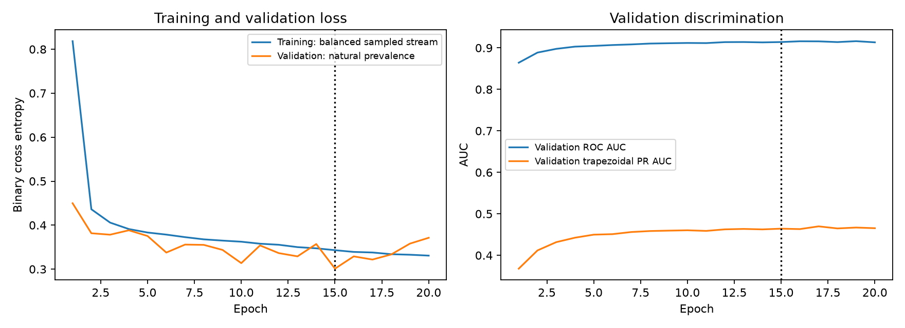

# Full m6Anet training on data0

Selected **epoch 15**, the checkpoint with the lowest validation
binary cross entropy, **0.301076**. Training completed
**20 epochs**. Stop reason: `validation_loss_early_stopping`.

## Epoch selection

- Prespecified ceiling: 50 epochs; minimum: 10 epochs.
- Stop after 5 epochs without an improvement greater than
  0.0005 in validation binary cross entropy relative to the last
  meaningful improvement. The checkpoint with the absolute lowest loss is retained,
  even if its improvement is smaller than this patience threshold.
- Each validation epoch averages 5 passes using the
  same seed (1042) and worker allocation. Validation RNG is
  isolated from training RNG to keep the comparison stable.
- Selected checkpoint training-stream loss: 0.343068.
- Training loss is measured on the balanced oversampled stream during optimization.
  Validation loss is measured after the epoch at natural class prevalence. Their
  absolute difference is not a directly comparable train/validation generalization gap.
- Test data never participates in stopping or checkpoint selection.

Last recorded epochs:

| Epoch | Training loss | Validation loss | Best epoch so far |
|---|---:|---:|---:|
| 15 | 0.343068 | 0.301076 | 15 |
| 16 | 0.339125 | 0.328959 | 15 |
| 17 | 0.337832 | 0.321757 | 15 |
| 18 | 0.333971 | 0.333402 | 15 |
| 19 | 0.332734 | 0.358024 | 15 |
| 20 | 0.330740 | 0.371273 | 15 |



## Selected model validation metrics

| Metric | Value |
|---|---:|
| Average precision | 0.464915 |
| ROC AUC | 0.914030 |
| Trapezoidal PR AUC | 0.464229 |
| Binary cross entropy | 0.301076 |
| Brier score | 0.088343 |

These are development validation results, not test estimates. The checkpoint's saved
predictions were reproduced exactly after reloading its weights. No pretrained weights
or pretrained normalization were used.

## Data and implementation

- Frozen v2 split: 71,794 training,
  25,350 validation, 24,694 test sites.
- All partitions are disjoint by gene and transcript. The test fold was part of
  historical v1 training, so old v1 models cannot be used for independent test claims.
- Training-only official motif normalization, official m6Anet architecture and loss,
  learned sequence embedding, 20-read Noisy-OR pooling, official balanced oversampling.
- Adam learning rate 0.0004, weight decay 0.0,
  batch size 256. CPU Docker, Linux amd64 emulation on arm64 macOS,
  4 PyTorch threads and 2 DataLoader workers.
- Normalized reads are cached in RAM. Cached sample features, motif indices, and labels
  were compared exactly against the official dataset under matching RNG states.
- The main uv Python environment remains separate from the pinned legacy container.
- Data1/data2 remain unused. Test predictions were not generated.

## Measured runtime

| Stage | Seconds |
|---|---:|
| Input adaptation | 41.4 |
| Training-only normalization | 69.6 |
| Build normalized read cache | 60.8 |
| All training epochs | 396.0 |
| Per-epoch validation passes | 81.5 |
| Full run through metric export | 665.0 |

Full recorded runtime: 11.08 minutes. This includes the final
checkpoint prediction verification. Main-process peak RSS was
820.8 MiB; the largest child peak was
713.7 MiB. These are separate process peaks, not a
sum of simultaneous RAM usage or a Docker VM total.

## Reproduce and reuse

```bash
uv run python scripts/train_m6anet.py --config configs/experiments/m6anet_full.toml
uv run python scripts/report_m6anet_training.py
```

Run directory: `experiments/data0_m6anet_full_v2/20261005T104640_official_m6anet_m6anet_scratch_c7794b10`.

- `official_output/model_states.pt`: selected model weights, suitable for the official
  m6Anet model architecture saved in `official_output/model_config.toml`.
- `official_output/train_norm_dict.joblib`: matching training-only normalization.
- `official_output/checkpoint.pt`: selected weights plus optimizer, RNG, history,
  and early-stopping state.
- `official_output/last_checkpoint.pt`: final-epoch state for future recovery work.
  The current CLI starts a fresh logged run; it does not yet expose a resume command.
- `official_output/history.csv`, `learning_curves.png`, `training.log`, and
  `validation_predictions.parquet`: recorded learning trajectory and selected predictions.
- Source snapshots, image ID, environment and input hashes, and `artifact_hashes.json`
  preserve provenance. `experiments/index.csv` indexes the completed experiment.

Historical smoke, classical, and pretrained reports are retained. Classical v1 models
used a larger training partition, and the pretrained model has unknown training overlap.
Their scores are contextual references, not matched v2 training comparisons.
