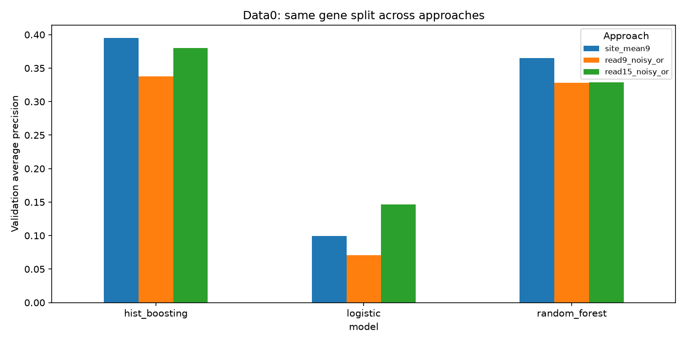

# First classical baseline results

Completed on 5 October 2026 using only data0. All scores below are development validation scores, not independent test results.

**Main result:** histogram gradient boosting on the nine site means has the highest average precision in this fixed initial comparison. Preserving read-level signals with inherited labels and Noisy-OR did not consistently improve performance.

| Model | Approach | AP | ROC AUC | Trapezoidal PR AUC | Brier score |
|---|---|---:|---:|---:|---:|
| logistic | site_mean9 | 0.0994 | 0.7071 | 0.0987 | 0.0406 |
| logistic | read9_noisy_or | 0.0709 | 0.6934 | 0.0707 | 0.3323 |
| logistic | read15_noisy_or | 0.1466 | 0.7760 | 0.1461 | 0.2944 |
| hist_boosting | site_mean9 | 0.3948 | 0.8641 | 0.3943 | 0.0321 |
| hist_boosting | read9_noisy_or | 0.3375 | 0.8604 | 0.3366 | 0.2713 |
| hist_boosting | read15_noisy_or | 0.3799 | 0.8782 | 0.3793 | 0.2375 |
| random_forest | site_mean9 | 0.3649 | 0.8589 | 0.3640 | 0.0333 |
| random_forest | read9_noisy_or | 0.3282 | 0.8538 | 0.3273 | 0.2846 |
| random_forest | read15_noisy_or | 0.3288 | 0.8654 | 0.3282 | 0.2530 |

**Design and checks**

- train: 96,488 sites, 3,077 genes, 4,372 positives (4.53%).
- val: 25,350 sites, 775 genes, 1,103 positives (4.35%).
- All 13 runs completed: the primary approach/model matrix, the prevalence dummy, and matched-read mean controls.
- One saved gene-disjoint split and the same sampled reads were used across comparable experiments. The report builder verified identical validation keys and labels across the primary comparisons.
- Every model passed a save/load prediction check. The prediction-only script is separately checked on exported data0 validation JSON; see `prediction_verification.json`.
- The unit/integration suite checks parsing, group isolation, deterministic sampling, pool endpoints, feature order, train-only scaling, bundle prediction, CSV validation, data0 scope, and successful/failed run logging.
- No hyperparameter search, calibration fit, data1/data2 evaluation, official m6Anet inference, final refit, or upload was performed.

**Interpretation**

- A2 has lower AP than A1 for all three estimators. A3 improves on A2 for each estimator, but surpasses A1 only for logistic regression in this comparison. No significance claim is made from these point estimates.
- Histogram boosting A3 has a higher ROC AUC than A1 while A1 has higher AP. This difference reinforces the need to retain both ranking metrics for the imbalanced data.
- All read-based models have substantially higher Brier score and log loss than the corresponding site-mean model. Fixed-size pooling controls read-count effects, but does not correct the mismatch between inherited site-label targets and the Noisy-OR interpretation.
- The fixed PCA encoding retains 46.62% of descriptor variance and produces 35 distinct vectors for 66 motifs at ten-decimal precision. This is an observed limitation of the approved two-dimensional non-neural encoding.
- Matched-read mean controls remain competitive. Their metrics are retained in `comparison.csv`; reducing the read count alone does not explain the read-model ranking.
- The constant dummy AP equals validation prevalence. Its trapezoidal PR area is inflated by straight-line interpolation between a few tied-score operating points and must not be interpreted as strong prediction.

**What to discuss with the team**

- Use the site-mean boosting model as the current reference by AP, while retaining the read/sequence variants as documented experiments.
- The next scientific question is whether training directly on a bag-level objective improves Noisy-OR performance. The current weak-label implementation cannot answer it.
- A full sequence one-hot control could distinguish loss from PCA compression from limitations of read-level learning. Calibration should be fitted using grouped training-only folds if pursued.
- These are proposed follow-ups; the current approved scope is complete without silently changing its objectives.

**Reproduce and inspect**

- Run `uv sync --locked --group dev --group notebook`, then `uv run python scripts/run_experiments.py`.
- Each model/config/source snapshot and prediction table is referenced by `experiments/index.csv`. Large artifacts are local and ignored for new Git additions.
- Executed notebooks: `notebooks/01_data0_and_split.ipynb`, `02_classical_comparison.ipynb`, and `03_diagnostics.ipynb`.
- Tested on this Apple Silicon macOS environment. A clean AWS Ubuntu installation has not been verified in this session.
- Scientific source: Hendra et al. (2022), DOI: https://doi.org/10.1038/s41592-022-01666-1. This implementation uses a classical approximation rather than the paper's jointly trained neural MIL model.

**Additional benchmark:** the subsequently requested official pretrained m6Anet comparison is recorded in [m6anet_comparison.md](m6anet_comparison.md). The original classical results above are retained.
